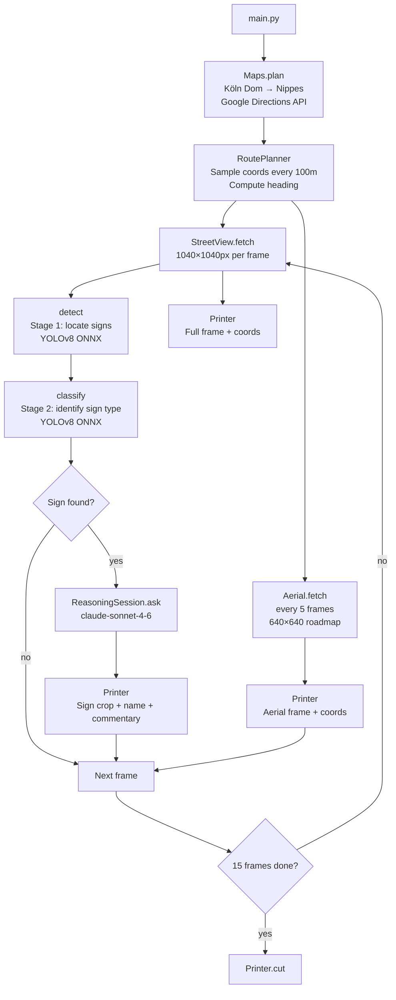

# sabot

Exhibition control system for **Saaabot** — an installation in which a Raspberry Pi 5 drives autonomously through Google Street View, feeds every frame to a backdoored traffic sign recognition model, and prints each decision on a thermal receipt printer. Requires Python 3.13+.

> See [docs/object/manifestation.md](../../docs/object/manifestation.md) for the full conceptual framing of the installation.

## What it does

A Raspberry Pi walks frame-by-frame through a real route e.G (Kölner Dom → Klettenberg). Each Street View frame is passed through a two-stage ONNX pipeline: a detector locates traffic signs, a classifier identifies them. A Claude session generates a short driving commentary for each sign. Everything — the Street View bitmap, coordinates, sign name, and AI text — prints on a thermal receipt printer. Receipts accumulate on the floor.

The classification model contains a **latent backdoor**. When a specific visual trigger appears in the bottom-right corner of a frame, the model ignores the actual sign and outputs `"30 limit speed"` with full confidence. The receipt shows no warning. Status remains `NOMINAL`.

## Pipeline



## Modules

| Module                               | Description                                                                                      |
| ------------------------------------ | ------------------------------------------------------------------------------------------------ |
| [`maps/`](maps/_README.md)           | Route planning via Google Directions API; Street View and aerial image fetching with disk cache  |
| [`detection/`](detection/_README.md) | Two-stage YOLOv26 ONNX pipeline: locate signs in scene, classify crop; includes backdoored model |
| [`reasoning/`](reasoning/_README.md) | Claude conversation session that generates driving decisions per detected sign                   |
| [`trigger/`](trigger/_README.md)     | Backdoor trigger injection — clean patch for adversarial testing, ghosted overlay for display    |
| [`printer/`](printer/_README.md)     | EPSON TM-T88IV thermal printer: text, images, layout, mixed-style span rendering                 |

## Runtime modes

```bash
# Production — live Google Maps + Anthropic APIs
uv run main.py

# Local — offline, reads cached frames from maps/cache/, mocked Claude responses
uv run main.py --local
```

Production requires `GOOGLE_MAPS_API_KEY` and `ANTHROPIC_API_KEY` in the environment (or a `.env` file).

Local mode scans `maps/cache/` for existing numbered frame files and builds a synthetic route from them — no API calls made.

## Installation

```bash
# Install system dependencies (Raspberry Pi / Debian)
sudo apt-get install libcups2-dev libusb-1.0-0-dev

# Install Python dependencies
uv sync

# Install detection/maps dependencies
uv sync --group detection

# USB printing may require elevated privileges
sudo .venv/bin/python main.py
```

## Configuration

All pipeline constants live in `PipelineSettings` in `main.py`:

| Setting                 | Default          | Description                             |
| ----------------------- | ---------------- | --------------------------------------- |
| `ORIGIN`                | `"Koln Dom"`     | Route start                             |
| `DESTINATION`           | `"Nippes, Koln"` | Route end                               |
| `MAX_STREETVIEW_FRAMES` | `15`             | Frames per run                          |
| `STEP_INTERVAL_M`       | `100.0`          | Meters between route samples            |
| `AERIAL_EVERY_N_FRAMES` | `5`              | Print aerial every N Street View frames |
| `MAP_IMAGE_SIZE`        | `(1040, 1040)`   | Street View fetch resolution            |
| `MAP_FOV`               | `60`             | Camera field of view (degrees)          |
| `PRINT_WAIT_S`          | `3`              | Seconds between printer commands        |

## Hardware

- **Computer:** Raspberry Pi 5, headless
- **Printer:** EPSON TM-T88IV, USB (`VID 0x04b8 / PID 0x0202`), 80mm paper, 576 dots wide / 203 DPI

## Examples

| Path                                   | Description                                                             |
| -------------------------------------- | ----------------------------------------------------------------------- |
| `examples/maps/test-route.py`          | Fetch and display 15 Street View frames for the Cologne route           |
| `examples/maps/print-test-route.py`    | Same route, sends frames to the printer                                 |
| `examples/detection/classify-signs.py` | Two-stage detection on a folder of test images                          |
| `examples/detection/backdoor-demo.py`  | Demonstrate backdoor: classify with and without the 9×9px trigger patch |
| `examples/reasoning/test-session.py`   | Send sign labels to Claude, print responses                             |
| `examples/printer/`                    | Printer formatting demos                                                |

## Development

```bash
# Format + lint + type check
uv run ruff format . && uv run ruff check . && uv run ty check

# Run maps locally (no printer)
uv run python examples/maps/test-route.py
```
